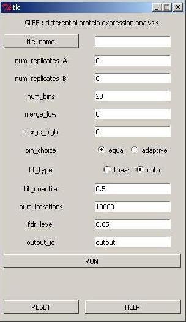

## glee-py

#### Download

current version (Nov 8, 2012) : [windows (32-bit)](https://docs.google.com/open?id=0B8KLKywXy-wKbk9TLWdCOXMxV2c) [linux (32-bit)](https://docs.google.com/open?id=0B8KLKywXy-wKSDNoM1NrRXg4dzg)

#### Documentation

- [options](docs/options.html) : contains an explanation of input options
- [format](docs/format.html) : specifies the input data format
- [template](files/template.xls) : use this to prepare your dataset for analysis
- [output](docs/output.html) : describes each output file produced by the software
- [faq](docs/faq.html) : frequently asked questions (and answers)

#### Description

GLEE conducts a statistical test to identify differentially expressed proteins using (normalized adjusted) spectral count data. 
 
To get started:

1. Download the glee.exe file for your operating system from the links above. 

2. Put the downloaded file in a directory for which you have user-level write privileges, such as your "My Documents" folder.

3. Double-click the glee.exe file to open up the user interface (GUI). No other installation steps are needed. The software comes with all dependencies packaged into the executable, and this makes starting up a bit slow. So, it might take up to a minute for the GUI to show up when you first start it. 

4. Select your input file, set the options and run!  See the "Documentation" section above for guidance on input parameters and how to format your input data file.

#### Credits

Anton Poliakov proposed GLEE's non-linear model for the mean-variance relationship observed in proteomic spectral count data. Lalit Ponnala developed the software using Python and its associated libraries such as Tkinter, Numpy, Scipy and PyInstaller.

#### Contact

If you run into issues with the software or have comments for improving it, contact Lalit Ponnala [lalit dot p at gmail dot com]. 
If you have questions related to proteomics data and differential expression, contact Anton Poliakov [poliakov at med dot umich dot edu]. 
